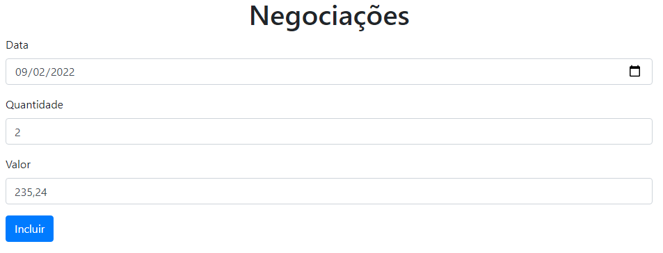

#   TypeScript Parte1: Evoluindo seu javaScript

Este curso aprendemos a configurar do zero seu ambiente.
Conhecemos gradativamente os recursos do TypeScript compiler.
Compreendemos as vantagens da tipagem estática.
Modelagem das classes utilizando o que há de melhor na linguagem.
Aprendemos a utilizar tipos, modificadores, Generics entre outros

# ScreenShot

## FORMULÁRIO DE CADASTTRO DA NEGOCIAÇÃO

### O que aprendemos no módulo 01
- Introdução ao projeto e sua estrutura
- Um pouco sobre módulos do ECMASCRIPT
- Modelagem de uma Negociação em Javascript
-  Buracos em nossa modelagem por limitações da linguagem Javascript

### O que aprendemos no módulo 02
- Configuração do compilador e papel do tsconfig.json
- Integração com scripts do Node.js
- Modificadores de acesso private e public
- Benefícios iniciais da linguagem TypeScript

### O que aprendemos no módulo 03
- O tipo implícito any
- Benefícios da tipagem estática
- Mais configurações do compilador tsc
- Retorno de método explícito
- Conversão de valores da interface do usuário

### O que aprendemos no módulo 04
- Utilização de Generics
- Revisão sobre encapsulamento
- Questões de mutabilidade e como solucioná-la
- O tipo ReadonlyArray
- Adição de negociações em nossa lista

### O que aprendemos no módulo 05
- Nova maneira de declaração de array com generics
- O tipo ReadonlyArray
- O modificador readonly
- Getters vs propriedades públicas em modo de leitura
- Programação defensiva

 # CONCLUÍDO

 
<h1 align="center">💻 Desenvolvido Por: Gilberto Júnior</h1>
